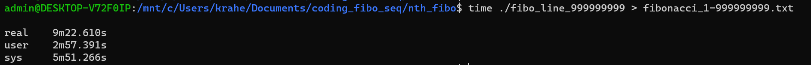

# fibonacci_sequence

## Fibonacci Sequences with Binets Formula
while analyzing the results from the first program, that supposedly outputs the first 999999999 fibonacci numbers, i found out, that it's not the real deal, what is actually outputted, that's why I looked into **binets formula** (Source: [maths.surrey.ac.uk](http://www.maths.surrey.ac.uk/hosted-sites/R.Knott/Fibonacci/fibFormula.html)) and found that it works in a c script up to the 1474-th term in my local dev shell, a [list of the values](./fibo_list_1474.txt) can be found in this repo
The accompanying C program to generate can be found [here]() aswell 

---

# original method (doesn't work for some reason)
generating a fibonacci sequence in c++/cpp and getting the values with script

## quick start
- download [latest binary](https://github.com/3n3a/fibonacci_sequence/releases/tag/v0.0.1)
- with ```./fibo_line_999999999``` can start outputting
- (OPTIONAL: use the bash scripts in this directory to measure time and output to file)

## compile from source
- clone this repo
- make sure you have make tools installed
- make fibo
- measure_fibo_line_999999999.sh

## the txt file you get...
- will be around 19GB 
- takes around 10min to generate, with intel i7-3300, and cheap ssd


